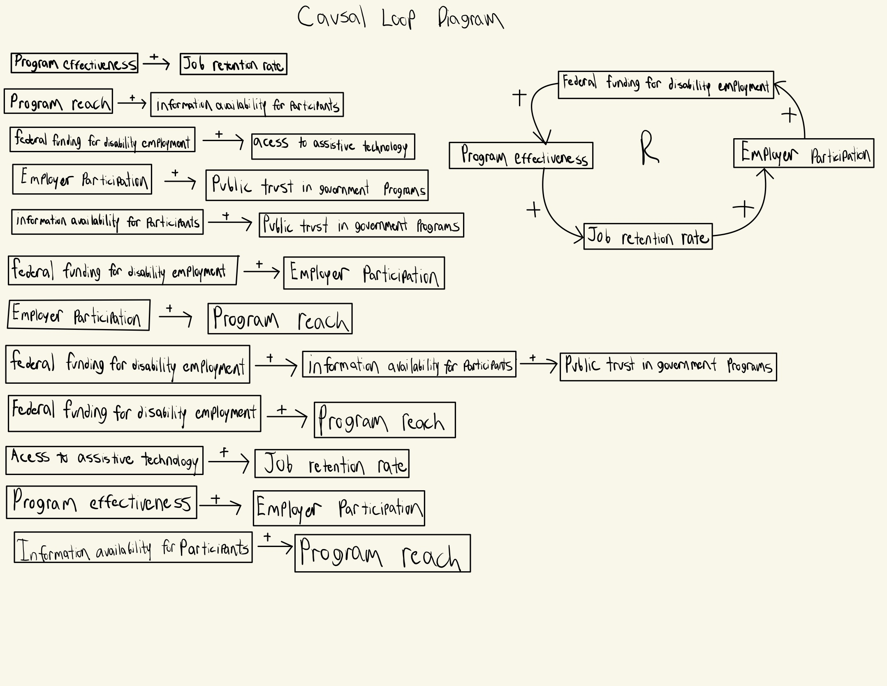

# Canada Disability Employment Program

## Decision Statement

How should the federal government allocate limited additional funding for disability employment programs: expanding existing programs, modifying program design, or investing in complementary supports?

> [!TIP] 
> This is a great project, but it's ambitious. Let's simplify life a bit and focus on a goal/KPI - such as % of population who are employed, or mean salary for disabled folks. Then, if we have that, and historical data, we can do a multiple linear regression analysis to see what lever is most meaningful. Next step is to pick the KPI.

## Executive Summary

People with disabilities are often underrepresented in the Canadian work force because of the barriers they face in the workplace such as the workplace being inaccessible, discrimination in hiring processes, etc. While there are a number of organizations around Canada that focus on the employment of those with disabilities, they are often underfunded or because of the number of organizations that exist, employer partnerships may be difficult to obtain. These challenges often make the program’s capabilities limited, thereby impacting people with disabilities who benefit from these programs to become employed.

While it may not actually be the case, if the Federal government of Canada were to receive funding (though it would be limited), to put towards disability employment programs across the country, the Minister of Jobs and Families the Honourable Patty Hajdu, would have to decide how to use the funds. They could either: expand the programs already in place, create a brand new program or invest in supports that would be complementary to the participants of these programs, both employers and the people with disabilities themselves.

[Read more](background.md)

## Inital Causal Loop Diagram

When federal funding for disability employment programs increases, that increases the effectiveness of programs thereby increasing the job retention rate for people with disabilities. Employers then see the results and want to get involved, increasing the employer participation and the federal government sees how well this is going and increases their funding for disability employment programs.

## References

Statistics Canada. (2025, May 15). Labour market indicators for persons with and without disabilities, annual. Statistics Canada Retrieved Feburary 27, 2026 from https://www.statcan.gc.ca/en/start
